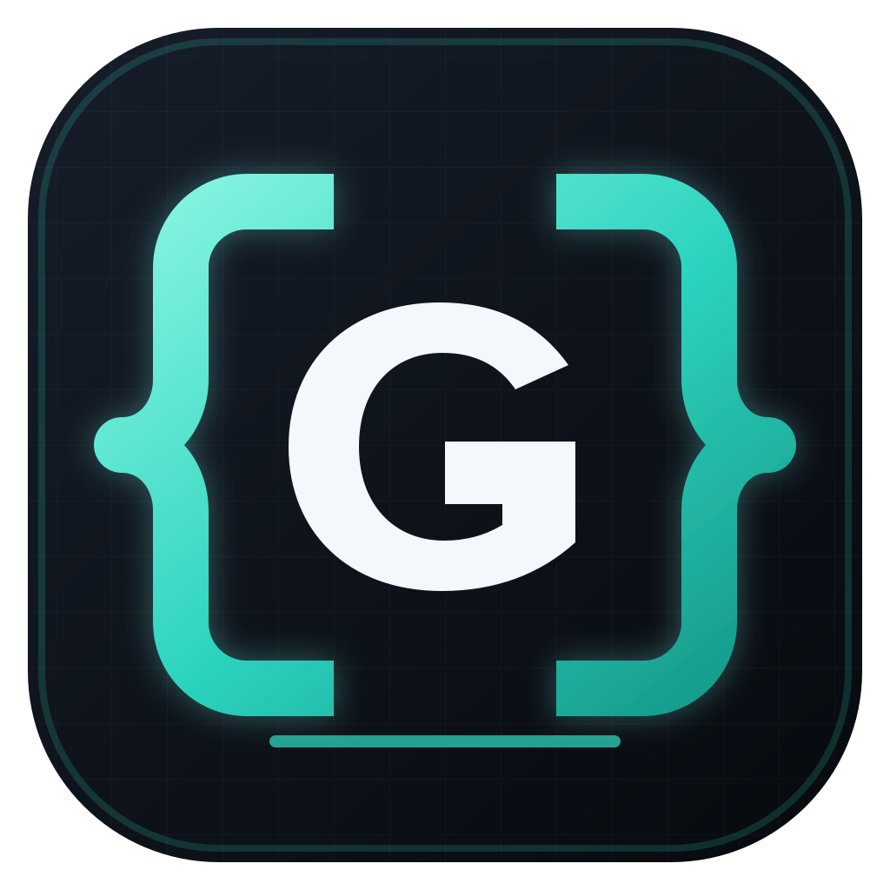

<p align="center">
  
</p>

<h1 align="center">UGC{Gen}</h1>

<p align="center">
  <strong>Local-first AI production workflows for images, video, text, and reusable identities.</strong><br />
  Build, run, inspect, and automate generation pipelines on a visual canvas.
</p>

UGC{Gen} is a local-first desktop and browser application for building production-grade AI media workflows. This product extends the original HeliosGen canvas with live provider catalogs, identity dossiers, reusable production templates, cost and provenance tracking, community workflow imports, ComfyUI interoperability, and a writable MCP server for agent control.

The application, workflow database, settings, and generated-media library run locally. Generations still send the prompt and any required reference media to the provider you explicitly select, such as Kie.ai, WaveSpeed, Azure Foundry, or ComfyUI Cloud. Local ComfyUI and Codex CLI routes can remain on the machine, subject to their own configuration.

> The current product work is on the `codex/wavespeed-provider` branch. Use the source instructions below to run this version; an upstream release does not include the features documented here.

## Run locally

From an existing checkout, start the browser development app:

```bash
corepack enable
pnpm install
pnpm dev
```

Open [http://localhost:3000](http://localhost:3000). If an older UGC{Gen} process is already using port 3000, stop it with `Ctrl+C` in its terminal and run `pnpm dev` again from this directory.

API keys are normally added inside **Settings → API Keys**. They are stored in the local SQLite database and are never returned by the MCP server. `.env.local` is optional; see [`.env.example`](.env.example) for supported development fallbacks.

## Clone the current product branch

```bash
git clone --branch codex/wavespeed-provider https://github.com/TheMarcusLee/HeliosGen.git
cd HeliosGen
corepack enable
pnpm install
pnpm dev
```

Requirements:

- Node.js 22.13 or newer
- pnpm 9.15.9, selected through the repository's `packageManager` field
- Provider credentials for the remote services you choose to use

## What this fork adds

### Provider and model layer

- Kie.ai image, video, and text generation
- Authenticated WaveSpeed model discovery with a live image/video catalog
- Schema-generated WaveSpeed canvas controls, typed inputs, defaults, and validation
- Ordered compatible fallbacks and per-node estimated-cost ceilings
- Azure Foundry and optional Codex CLI routing for supported operations
- Local ComfyUI and ComfyUI Cloud API-workflow execution
- Persistent provider transaction ledger with provider, model, operation, estimate, status, fallback, workflow, identity, and output provenance

WaveSpeed models are discovered live instead of being frozen into the repository. After saving a WaveSpeed key, browse them in **Settings → Image Models** or **Settings → Video Models**, or add a WaveSpeed node to a workflow. The model's current request schema determines the controls shown on the canvas.

The configured text catalog currently includes:

- Anthropic: Opus 5, Sonnet 5, plus legacy Opus 4.7, Sonnet 4.6, and Haiku 4.5 compatibility
- OpenAI: GPT 5.6 Sol, GPT 5.6 Terra, GPT 5.6 Luna, GPT 5.5, GPT 5.4, and GPT 5.2
- Google: Gemini 3.8 Flash, 3.7 Flash, 3.6 Flash, 3.5 Flash, 3.1 Pro, and 3 Flash
- Azure Auto routing

Kie.ai image/video entries are maintained by the application catalog. The WaveSpeed portion is deliberately dynamic, so the provider's current model list is the source of truth.

### Identity layer

**Identities** is a first-class production asset library rather than a loose collection of prompt fields. Each dossier can contain:

- multiple face and body reference images
- a stable trigger word
- reusable base prompts (prompt DNA)
- explicit SFW or adult content classification
- provider, model, and aspect-ratio defaults
- immutable version snapshots used by linked workflows
- import/export JSON, workflow links, run activity, and provenance

Multiple images can be dropped into the reference area at once and classified individually as face or body references. Editing an identity creates a new version, so an existing workflow keeps its embedded snapshot until it is intentionally refreshed.

### Prompt library and builder

**Prompts** in the sidebar is a local library of proven image prompts. It lives in the app database, never in the repo: the seed library is personal, and another user brings their own by uploading a JSON file (an array of `{ prompt, title?, categories?, imageUrls? }`, or a prompt-palette-pro export as-is; duplicates by id update, duplicate bodies are skipped). The planner receives the three closest library prompts to the latest brief as *style references* and is instructed to match their specificity, not their subjects: ethnicity and age in the first sentence, exact garments and fabrics, pose geometry, focal length and distance, lighting in Kelvin, and skin realism language.

The **prompt builder** on the same page ports prompt-palette-pro's edge functions onto the connected accounts (Google account through Antigravity first, then OpenAI), at the cheap inspection tier:

- **Describe**: a short brief plus the closest library prompts as few-shot examples.
- **From image**: a photo → VisionStruct analysis → Reality-First structured JSON prompt (for Nano Banana Pro) and narrative prose (for GPT Image and Grok).
- **Enhance**: a rough prompt → inferred VisionStruct → the same two outputs. The brief editor on a plan offers this per step and shapes the output for the campaign's image model.
- **Remix**: one change applied to a library prompt.

Results can be saved back into the library with their analysis, structured form, prose and negative list.

### Content formats and starter identities

The composer's **format** picker (Plan & create mode) applies a structural content format from the playbook brought over from App Promo Factory: a hook pattern, ordered beats, a slide count and the channels it suits, plus a five-slide Gen Z creator carousel recipe. The planner maps beats to steps in order, adds one caption step for the sequence, shapes the first caption on the hook pattern, and is held to the playbook's truthfulness rules (no invented metrics, testimonials or capabilities).

The identity library has a **Starter templates** section: described personas with a reference image, uploaded as JSON (an array of `{ name, prompt, imageUrl?, category? }`, or an App Promo Factory / Viral Reel Creator `influencer_templates` export unchanged). "Use as identity" mirrors the image into local media and creates an identity whose base prompt is the persona description with its locked trait list. Templates stay in the local database, not the repo.

### Production workflows

Built-in CloneMe-style templates turn identities into repeatable production pipelines:

- **Scene replacement:** target scene → Opus 5 vision analysis → identity-aware prompt construction → provider generation → gallery and ledger output
- **Pose × outfit batch:** analyze once, cross-product selected poses and outfits, then execute with bounded concurrency
- Persistent queue states: idle, analysis, generation, completed, paused, and error
- Pause, resume, retry, and explicit per-item status tracking

Workflow metadata controls SFW/adult routing explicitly and auditably. UGC{Gen} does not infer adult capability from a model name. Provider rules still apply, and server-side validation rejects sexual content involving minors and non-consensual intimate imagery.

### Workflow portability and interoperability

- Node Banana community workflow browser and versioned converter
- ComfyUI workflows imported from **Save (API Format)**
- Portable workflow ZIP exports containing `workflow.json` and referenced media
- Prompt-template nodes, annotations, and non-destructive image markup
- Imported public Helios workflows remain editable on the native canvas

See [the implemented provider and workflow roadmap](docs/node-banana-review.md) for design notes and feature provenance.

## Campaign chat workspace

The app opens into **Chat**, a persistent creative workspace. Build an influencer in conversation, review generated reference options, save a favorite to Identities, and continue into campaign production. Each campaign has its own searchable history, identity snapshot, references, plans, runs, and session gallery. Existing browser-local prompt chats remain accessible in the sidebar.

The assistant proposes a structured plan before media generation. Approve the listed generations to execute image and five-second image-to-video jobs through the selected providers. Outputs appear inline and in the session gallery; approve/reject assets, download them, or use an image as the reference for a new variation. Content packs carry individual wardrobe and setting briefs while the saved identity remains unchanged. Completed plans open as editable workflows on the canvas.

Campaign records are stored in the local SQLite database. A server worker advances durable runs every three seconds, with renewable SQLite leases to prevent duplicate submissions across server instances. Chat windows only read progress. Production continues with every browser chat closed while the server is running. On macOS, closing the desktop window hides it and keeps the server alive; clicking the Dock icon reopens it. Explicitly quitting the app or shutting down the machine stops local execution; on restart, known provider jobs recover by job ID. Local Codex image processes cannot be resumed after a process crash, so uncertain jobs stop for inspection. An interrupted submission without a saved job ID stops for inspection rather than automatically charging again. Pause finishes the current provider job before holding subsequent steps.

New campaigns default to the host’s connected ChatGPT account for chat/planning through `codex exec`, and GPT Image 2 through the existing `codex-imagegen` adapter when installed. A connected **Google account through the Antigravity CLI** (`agy`, for Google AI Pro/Ultra subscribers) is the second option: choose “Google account · Antigravity” as the assistant model for planning and director reasoning, inspection and review, and as the image provider for Nano Banana Pro through the CLI’s native `generate_image` tool. Sign in once by running `agy` in a terminal; the app only spawns the CLI in a sandboxed workspace, never reads the keyring credential, and strips every Gemini/Google API-key variable from the child environment so runs cannot drift onto metered billing. There is no video generation through Antigravity. Video continues through Kie.ai. Explicit campaign choices are preserved. When a connected account fails an image (typically a silent policy refusal or a dropped stream), the campaign’s **Kie.ai fallback** resends that one request to Kie.ai with the same model at the published price, within the campaign’s dollar budget; the step or job is labelled as a fallback and keeps the original failure behind a “More info” toggle. The option is on by default for account-backed campaigns and can be turned off under “Generation providers & models” in the session gallery. Nothing else falls back silently. The image adapter is third-party and its availability depends on the account and backend. Install it with `uv tool install git+https://github.com/jdmnk/codex-imagegen-cli.git@a739870aa9d600cfd0c382b6c06f38d0b1f5108b` after `codex login`. Plan-mode outputs receive manual review. Research & adapt adds sampled-frame visual QA; publication still requires human approval.

**Campaign controls** contains four tabs:

- **Memory:** persistent brand brief, audience, voice, constraints, and product descriptions/reference URLs. Every save creates a restorable brief version; the planner receives current memory and each approved run freezes it. Image/video variations and caption edits preserve originals with parent/version links.
- **Budget:** a hard campaign-wide generation limit (24 by default), plus optional estimated-dollar allocation limits. The full plan reserves its allocation before submission. Failed/uncertain submitted jobs still count; unstarted cancelled jobs release their allocation. Per-generation prices resolve in order: a manual entry, then the median of your recent actual charges for that model (completed Kie.ai jobs report the credits actually deducted, recorded in the generation ledger), then the published Kie.ai price table in `lib/pricing.ts` (1 credit = $0.005; each entry carries its source page and an as-of date), then unknown, which blocks dollar-limited plans until you enter an estimate. WaveSpeed models are quoted from the `base_price` the API returns at listing time. Connected-account images reserve $0. Manual entries clear when you change models. None of this guarantees a provider billing cap. Account-backed image calls count toward generation limits and reserve zero API dollars; subscription limits remain separate. Unquoted API chat is blocked when a dollar limit is active.
- **Discover:** live TikTok keyword search through a built-in headless browser session (anonymous visitor cookie, no account or vendor), ranked by views per day, engagement, clip fit and recency, with the hashtags and sounds recurring across results. YouTube remains available through the official Data API with a key. Select sources to include them in planning context. TikTok/Reel/other links can be added manually and are labeled unverified. Nothing is downloaded on this tab and motion-transfer suitability is not claimed.
- **Publish:** approved assets become local drafts containing an exact caption, destination account and scheduled time. “Approve & schedule” authorizes the durable outbox. Local media uploads to PostBridge using signed upload URLs; scheduled/processing/posted/failed status is synchronized. Scheduled drafts can be cancelled; uncertain submissions require reconciliation in PostBridge and are never automatically retried.

Connect **YouTube Data API** and **PostBridge** in their tab’s connection section, or set `YOUTUBE_API_KEY` and `POSTBRIDGE_API_KEY` on the server. Keys stay on the server and are never returned to clients. PostBridge requires social accounts connected in its dashboard. Live integration calls require your own credentials; tests use mocked responses and do not publish. References: [YouTube search API](https://developers.google.com/youtube/v3/docs/search/list), [PostBridge API](https://api.post-bridge.com/reference). Worker health appears in Campaign controls. `HELIOS_DISABLE_CAMPAIGN_WORKER=1` disables it for isolated test servers.

## Agent control with MCP

The repository includes a local stdio MCP server with 41 read/write tools. It can inspect and mutate complete workflow graphs, manage identities and their versions, create production templates and batches, set explicit content routes, discover and run models, wait for jobs, import community workflows, execute ComfyUI graphs, and audit provider activity.

Keep UGC{Gen} running, then build the MCP server:

```bash
pnpm mcp:build
```

Example MCP client configuration:

```json
{
  "command": "node",
  "args": ["/absolute/path/to/HeliosGen/mcp/dist/index.js"],
  "env": {
    "UGCGEN_BASE_URL": "http://127.0.0.1:3000"
  }
}
```

The default base URL is `http://127.0.0.1:3000`. Set `UGCGEN_BASE_URL` when the app uses another port. The legacy `HELIOSGEN_BASE_URL` variable remains supported for existing MCP configurations. See [the MCP guide](mcp/README.md) for the available tool groups and the configuration already used on this machine.

## Desktop app

For a native window with hot reload:

```bash
pnpm desktop:dev
```

The first run compiles the Rust/Tauri shell and can take a few minutes. Desktop development additionally requires Rust, the platform's Tauri prerequisites, and on macOS the Xcode Command Line Tools.

Build a packaged app on the target operating system:

```bash
pnpm desktop:build
```

Artifacts are written beneath `src-tauri/target/release/bundle/`. Tauri does not cross-compile, so macOS, Windows, and Linux packages must each be built on their target platform. See [DESKTOP.md](DESKTOP.md) for architecture, signing, local paths, and packaging details.

## Local data

Browser development stores data inside the checkout:

- SQLite data: `data/`
- generated media: `public/generated/`

The packaged desktop app stores its writable data in the operating system's app-data directory:

| Operating system | Location |
| --- | --- |
| macOS | `~/Library/Application Support/cash.sdd.helios.desktop/` |
| Windows | `%APPDATA%\cash.sdd.helios.desktop\` |
| Linux | `~/.local/share/cash.sdd.helios.desktop/` |

Back up the SQLite database and `generated/` directory before removing an app-data folder. Deleting it resets local workflows, identities, settings, history, and media.

## Optional local tools

Some operations use command-line tools from the login shell's `PATH`:

- `ffmpeg` and `ffprobe` for video trimming and frame extraction
- `codex` and `codex-imagegen` for the optional Codex CLI image route

Missing optional tools disable only their related feature. For the Codex route, install and authenticate the Codex CLI, install [`codex-imagegen-cli`](https://github.com/jdmnk/codex-imagegen-cli), then choose **Codex CLI** for GPT Image 2 in **Settings → Image Models**.

## Development checks

```bash
pnpm lint
pnpm exec tsc --noEmit
pnpm exec tsx --test tests/*.test.ts
pnpm mcp:build
pnpm build
```

## Fork maintenance

This repository deliberately keeps two remotes:

- `origin`: `https://github.com/TheMarcusLee/HeliosGen.git` — this product fork
- `upstream`: `https://github.com/SegFault42/HeliosGen.git` — the original project

Review upstream changes without modifying the current branch:

```bash
git fetch origin
git fetch upstream
git log --oneline --left-right --cherry-pick HEAD...upstream/main
```

Integrate useful upstream work through a dedicated branch or pull request, then run the full development checks. This keeps provider, identity, workflow-import, MCP, and local-data behavior reviewable instead of silently overwriting the product fork.

## Tech stack

| Layer | Technology |
| --- | --- |
| Desktop shell | Tauri 2 and Rust |
| Application | Next.js 16, React 19, and TypeScript |
| Workflow canvas | React Flow |
| Database | local SQLite through Node 22 `node:sqlite` |
| Media storage | local filesystem |
| Providers | Kie.ai, WaveSpeed, Azure Foundry, Codex CLI, and ComfyUI |
| Agent interface | Model Context Protocol over local stdio |

## Project lineage

UGC{Gen} is a maintained fork of [SegFault42/HeliosGen](https://github.com/SegFault42/HeliosGen). The original project provided the visual workflow foundation; this fork carries the provider expansion, identity production layer, workflow interoperability, cost/provenance controls, and writable agent interface described above.

## Licensing

The checkout does not currently contain a license file. Add or confirm the intended license before distributing binaries or accepting outside contributions.


### Research & adapt agent

Choose **Research & adapt · Agent** in the chat composer, or its landing-page starter. Set the requested Reels/stills and optionally paste direct TikTok/Instagram Reel links or upload a 3–60 second source clip. The connected OpenAI account controls a durable tool loop: discover → retrieve → inspect timestamped frames → compare and select → clip → propose production → generate identity anchor → visual QA → reference-video generation → QA/revisions → matching stills and captions. Every source, clip, assessment, tool decision, attempt, and output is saved with the campaign. Source videos and timestamped evidence appear inline and in the source gallery; generated assets retain ordinary human review and publishing controls.

- **Discovery:** live TikTok search is the default. The server drives an installed Google Chrome headlessly (or the executable in `HELIOS_TIKTOK_BROWSER`) to hold an anonymous TikTok visitor session, calls the same public keyword-search endpoint the web app uses, and ranks results by views per day, engagement, clip fit and recency. Retrieval reuses that session for the video CDN and falls back to `yt-dlp` on the public page. No account, cookie export, key, or vendor is involved and searches are free; up to four are authorized per run. **OpenAI account web search** remains available as an alternative; its indexed coverage is incomplete. Supplied/uploaded clips use the same inspection pipeline.
- **Requirements:** `codex login` with a ChatGPT account, `yt-dlp`, `ffmpeg`, and `ffprobe` on the server PATH, and Google Chrome installed for live TikTok discovery (`playwright-core` drives it; no browser download). Account image production also requires the configured image helper; motion transfer requires the existing Kie.ai connection.
- **Instagram Reels:** public retrieval from Instagram is unreliable, so the repository bundles **InstaVault**, an unofficial Chrome extension, under `extensions/instavault`. Choose **Get the browser extension** in Campaign controls → Discover (the packaged app bundles it and copies it to a stable folder under its data directory), load that folder unpacked once (`chrome://extensions` → Developer mode → Load unpacked), browse Instagram in your normal session, select Reels you may use, and choose “Send selected to UGC{Gen}”. Clips land in the local media library and appear under **Captured clips** in Sources & output settings, ready to attach as sources. The capture endpoint accepts cross-origin requests only from a browser-extension origin, so no key is required and ordinary web pages cannot push media in. See [extensions/instavault/README.md](extensions/instavault/README.md).
- **Cost discipline:** a source video is never retrieved or inspected twice. Retrieval evidence is cached by canonical URL while its media stays on disk, and the visual assessment is cached per URL and identity, so repeated runs and revisions reuse earlier work (`HELIOS_DIRECTOR_NO_CACHE=1` bypasses). Frame inspection and output review run on an inspection-tier model while decisions stay on the reasoning tier: Antigravity uses Gemini 3.8 Flash at medium effort for inspection and at high effort for decisions by default (`HELIOS_ANTIGRAVITY_INSPECTION_MODEL`, `HELIOS_ANTIGRAVITY_MODEL`); Codex uses the account default unless `HELIOS_CODEX_INSPECTION_MODEL` or `HELIOS_CODEX_MODEL` is set.
- **Evidence:** FFmpeg extracts ordered, labeled frames at up to 2 fps (60 samples maximum), detects scene cuts, and prepares contact sheets. The account model assesses subject count, visible identity, occlusion, motion, aesthetic fit, and timestamped observations. This is sampled visual inspection, not continuous audiovisual analysis. Inaccessible, unsuitable, or unverified sources cannot silently become approved motion references.
- **Production:** approve the selected sources and a bounded allowance covering anchors, Reels, stills, and corrective generations. Select an identity first, or let the agent design one: a run with no saved identity selects footage first, then proposes an influencer whose look, framing and wardrobe fit those clips, and asks for a first, candidates-only approval. It then generates reference candidates as a split test (two on GPT Image 2 and two on Nano Banana Pro when both families are available, preferring connected accounts over Kie.ai; three on one family otherwise) and pauses (`awaiting_identity`) for you to pick one. The choice is saved to Identities, the winning model becomes the run’s image route, and the run returns to `awaiting_approval` for the separate production allowance before any adaptation is produced. Dance-oriented objectives favour clips whose captions and sounds read as routines. Changing the identity/brief/references causes source reassessment before approval. Choose the motion video model in **Sources & output settings**; any Kie.ai video model that accepts a reference video is available (Kling Motion Control, Seedance, MiniMax H3, Gemini Omni Video), defaulting to Kling 3.0 Motion Control. Clip length and dimension limits follow the selected model. Motion-control models transfer the source subject's motion and background; reference-video models use the clip as a motion reference and the anchor as first frame or identity reference. Images follow the campaign provider selection. The agent inspects every media output, keeps failed versions and corrective prompts, and cannot finish without the requested passing outputs and captions.
- **Recovery and budgets:** persisted server work continues without chat windows; pause/stop prevents subsequent steps while collecting already submitted jobs. Renewable SQLite leases exclude duplicate workers. Unknown submission outcomes are blocked and never automatically resubmitted; check the provider ledger. Generation allowance and conservative per-model estimates are reserved before production; unused allowance is released on completion/stop. Failed/uncertain requests count. These are planning estimates, not a provider billing guarantee. The entire local server must remain running.
